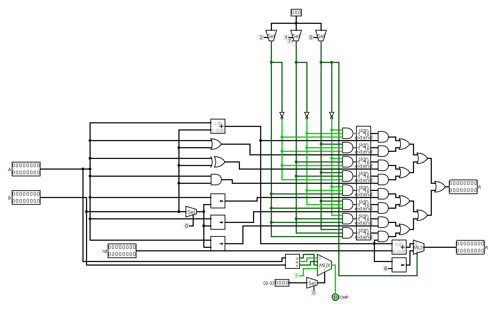

# Arithmetic Logic Unit
The ALU has two main outputs: **R** and **CMP**. R is **the result of the operation** specified at the last three bits of the codeop. CMP has three outputs: **lower, equal or higher**, but only one of them is sent as output, depending on the JMP operation. Here’s the circuit:

Firstly, **every operation is calculated**: add, or, xor, and, shift left, shift right logical and shift right arithmetic. Then, depending on the **opcode bits**, one of them is selected as the R output. It is worth noting that the add operation is used in the multiplexer’s inputs **twice**. This is because it is used in both 000 and 111 operations. An adder is used to **concatenate** the two 4-bit segments of the **mov** and **movu** operations. 

As for the CMP output, both A and B go through a **comparator** to calculate whether A is higher, lower or equal than B, and then an output out of the three is chosen via multiplexer (using the last two bits of the codeop as a select input).

## About subtraction
One might notice that **there is no operation to directly subtract**. The reason for this is that, having only 16 available instructions (the opcode segment being 4 bits long), the number of ALU instructions has to be limited. Nevertheless, subtraction *can* be performed under this Instruction Set Architecture by inverting the **B operand** with **xor** (B^0xFFF), and then adding the inverted result by A, and then incrementing by 1 **(A - B = A + ~B + 1)**.