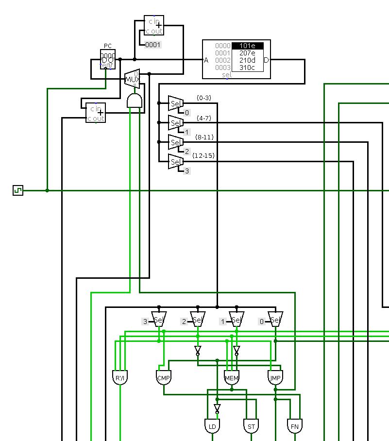
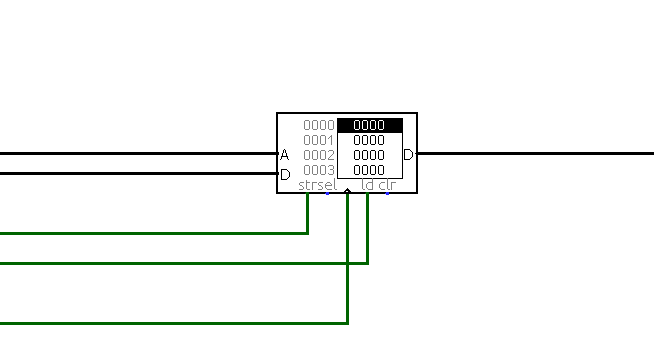

# Other parts of the processor

## Program Counter

The PC is directly connected to the **address input of the Program Memory**, and it will update (PC + 1) each tick of the clock. The output of the Program Memory is **the instruction to be executed**, whose segments go to their respective multiplexers and the CU. The multiplexer that can be seen below the PC dictates whether the PC updates to the jump address or to the next immediate instruction. The jump address is selected if the instruction is a **JMP type** and if the CMP bit taken out of the ALU is set.

## Data Memory

The Data Memory circuitry is very straight-forward. The value of the register equivalent to the s2 segment of the instruction (The bit set from 8 to 11) is connected to the **A (address) input** of the memory. The **D input** on the left is the value that will be stored in **A (ALU)** if the instruction type is **st**. The value connected to this input is the register value that is equivalent to the last 4 bits of the instruction. The **str** and **ld** inputs are connected to the **ST** and **LD** signals respectively, for the memory to know whether the operation type requires a **load or a store**.
