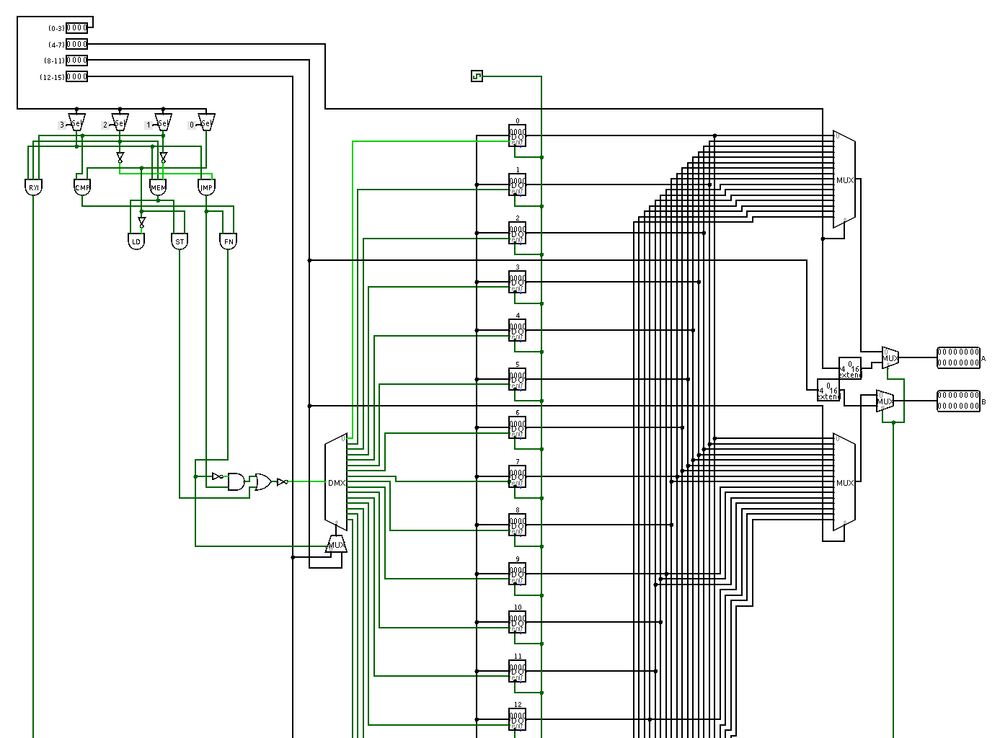
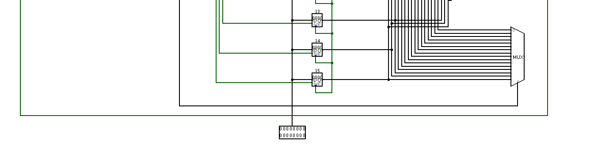

# Register Fetch Unit
The RFU is responsible for **getting the values of the appropriate registers and routing them** to the A and B ALU operands if necessary. In order to do so, the key instruction segments needed are the three last ones. Generally, s1, s2 and rd. Here’s the circuitry for this section of the processor.

The input of the demultiplexer (on the left) will be a 1 if the instruction is not a **JMP type** or a **storing instruction**. Then, the 1 (or 0) will be routed to the enable input of the **rd register** (as seen in the select bit of the demultiplexer). The other registers won’t be receiving that 1, meaning that the value received from the ALU or memory (in this case, the input square at the bottom of the circuit) will only be stored in the desired register (rd). 

The three multiplexers (on the right) **receive the values of every register as inputs**, and will give as an output the value of **the desired registers**. The one on the top is in charge of s1, the middle one of s2, and the last one at the bottom, of rd, which can be used as a source too. 

The s1 and s2 multiplexers are connected to two outputs, **A and B**. These outputs are the inputs the ALU receives to operate. However, the **mov** and **movu** instructions don’t need registers, as they are **immediate value instructions**. As a result, two multiplexers are needed at the end of the circuit to determine **whether what gets to A and B are the values of the desired registers, or the immediate values** of the instruction. For this, the **R'/I signal** is used, that determines if the values needed are from registers (R) or immediate (I).